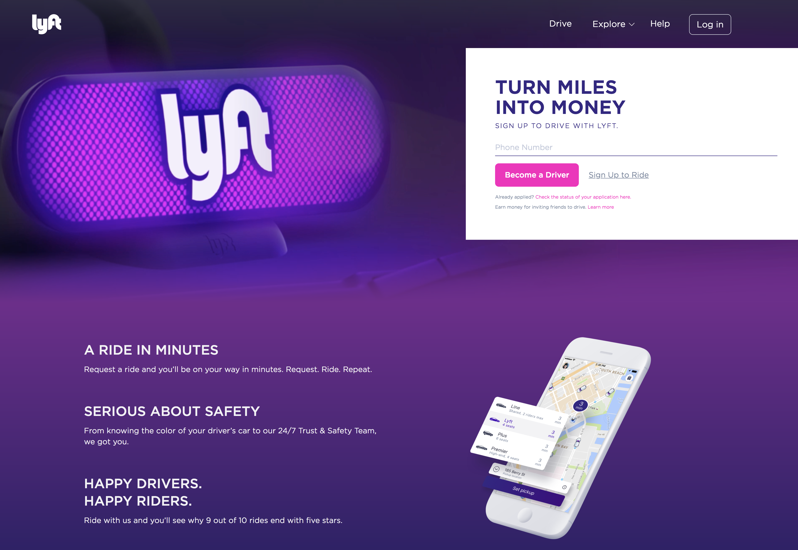

# Lyft-Clone
A clone of the Lyft website made during our first week of React, utilizing mapping, props, and styling in jsx.

The original page:

## Getting Started

* open terminal
* $ cd Desktop
* $ git clone https://github.com/lewdavidson/Lyft-Clone.git
* $ cd Lyft-Clone
* $ npm install
* $ npm run start
* open http://localhost:8080/ in the web browser of your choice

## Authors

* **Lew Davidson**  - [Lew Davidson](https://github.com/lewdavidson)
* **John Sawiris**  - [John Sawiris](https://github.com/JohnSawiris)

## License

This project is licensed under the MIT License - see the [LICENSE.md](LICENSE.md) file for details
This proaject was made by two students at Epicodus.
